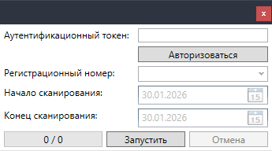
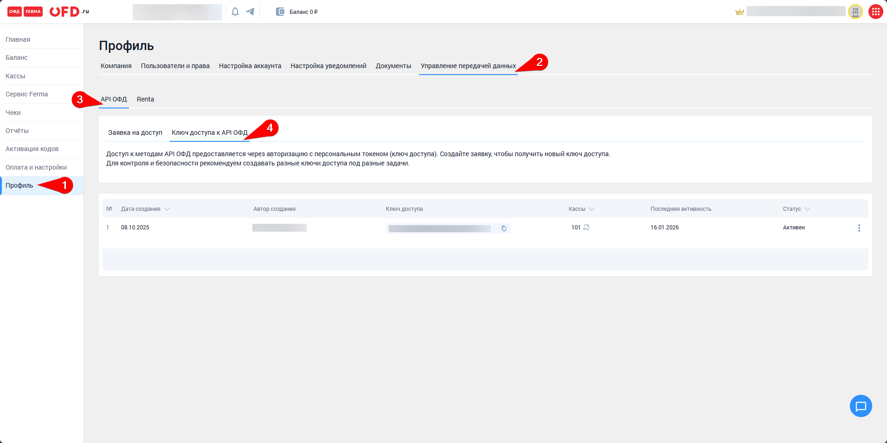
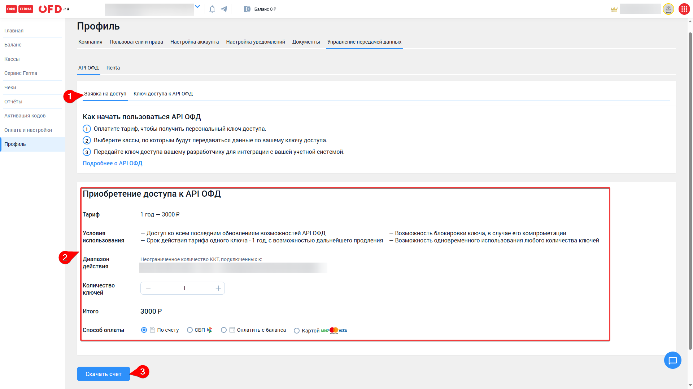

# Импортер "OFD.ru"

## Внешний вид импортера

## Необходимая информация для запуска импорта

- Аутентификационный токен OFD.ru
- Список регистрационных номеров ККТ, на которых были проведены ФД
- Период проведения "некорректных" ФД

## Получение аутентификационного токена OFD.ru

1. [Войти в Личный кабинет OFD.ru как клиент](https://lk.ofd.ru/sign/in)
2. Перейти в Профиль > Управление передачей данных > API ОФД > Ключи доступа к API ОФД
   
3. Если отсутствии активного ключ, то необходимо его приобрести во вкладке "Заявка на доступ":
   
4. Скопировать активный ключ доступа, нажав на кнопку "Копировать" ()